# Development Stories

## 0. Experimention : How to detect the opening of a camera shutter

### Description

The aim of this story is to choose the right components and the right electronic schema in order to be able to detect the opening of a camera shutter, i.e how to detect a light source using a light sensor

### Acceptance criteria

The choice of the components and schema allow to detect a light source using a light sensor

### Realisation

With the following schema, it would be possible to check different values of resistor, and measure
* The voltage value induced by the phototransistor current, depending on the light that illuminated it
* Which light intensity, for different resistor value, allow to swich the digital port of the Arduino

As a ligth source, we will use a standard led component, directly wired on the 5V output of the Arduino.  A 220 Ohm resistor is used to get an intensity less than 20 mA.  
20 mA is the maximum current value recommended both for Arduino output (even not used in this experimentation) and for a standard LED.  
$$
I = U/R = \frac{(5.0 - 1.2)}{220} \approxeq 17 mA
$$  

I = U/R = (5.0V - 1.2V) / (220 Ohm) ~= 17 mA  
(The direct voltage of the Led is 1.2V)  

And here is the schema :

Be carefull to plug the anode pin (the longer leg) of the phototransistor and the LED to the + side of the circuit

The following code will allow to get written on the serial of the Arduino, every second, the current analog and digital values read on the phototransistor :

[Experimentation code](DevelopmentSteps/Step0_Experimentation/experimentation/experimentation.ino)

### Results

The higher is the resistor value between the phototransistor, the more sensitive is the result.
- With a 1k Ohm resistor, the measured voltage change a little when putting the phototransistor in front of the led  
- The sensibility increases with increasing value of resistor
- When using 1M Ohm resistor, it is possible to change the input state at a ~ 5 cm distance
- When using 4x1M Ohm resistors (serial circuit), it is even possible to change the state at 10 cm

Questions :
- What is the limit of increasing sensibility ?
- Is there a side effect of increasing the resistor, as for instance a slower reactivity ?
- Is it better to use a more powerfull LED or higher resistor value ?

## 1. Detection of the time interval between rising and falling edges of the shutter

### Description 

The goal of this step is to do the minimum of design and development to be able to compute the time interval between rising and falling edges of the shutter.  
This step can be considered as a kind of derisking.

### Test means

The source of light may be provided by an external device 
The result output may be written (and read) on the serial port of the Arduino

### acceptance criteria
The system detects the rising and falling edges of the shutter
The system computes the time differences between rising and falling edges

### Bibliography

A similar problem has been adressed in this page :
https://lederniermatou.net/arduino-et-phototransistor.html

### Realisation

The following circuit has been realized, based on the experimentation :  

  

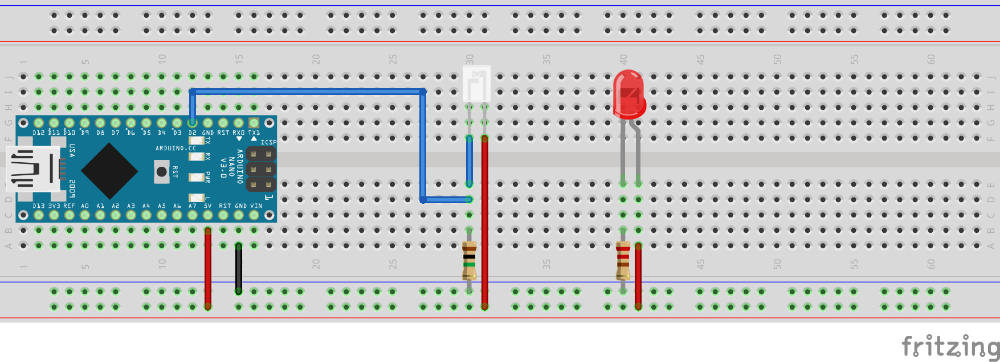

Note that, in order to use the interrupt capacity of the Arduino, only the D2 or D3 pins may be used for the phototransistor state change. The interrupt capacity is not available on the other pins.  

### Code

[Edges detection code](DevelopmentSteps/Step1_EdgesDetection/EdgesDetection/EdgesDetection.ino)

## 2. Implementation of behaviour states

### Description

The goal of this step is to implement the complete state diagram of the expected behaviour of the tool.  
The idea is to light on the source LED only when the user is ready to start the measure, and to switch it off as soon as the measure is performed.  
A button allows to start a new measure.

State diagram :

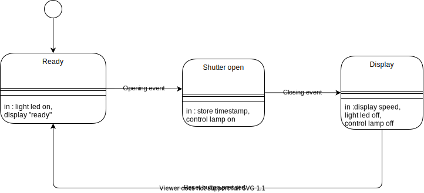

### Realisation schema :
The implementation of the state diagram needs :
- a way to switch on and off the illumination LED. The choice is to achieve this using a command transistor. The justification of this is that it allows to use a LED that uses more than 20 mA, without deteriorating the Arduino pin.
- a push button in order to be able to start the measure again.  

  

### Code  

[State diagram Code](DevelopmentSteps/Step2_BehaviourStates/BehaviourStates/BehaviourStates.ino)

## 3. Add control LED

### Description  

After the previous step, which was very complex, this one will be very easy.  
The goal is to add a control LED, that is lit when the phototransistor detects light. This helps the user to see that the illumination LED and the light sensor are correctly positionned.  
The control LED has to be switched on only during the "Shutter open" state.

### Realisation schema

Here is the realisation schema for this new element :  

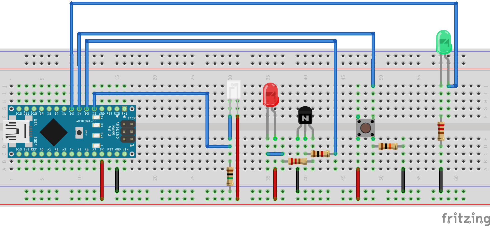  

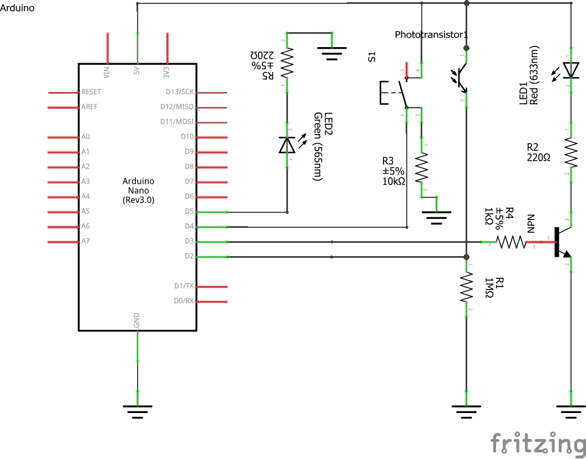

### Code  

In order to prevent the control LED to be too bright, we use the PWM capability of the Arduino

[Control LED](DevelopmentSteps/Step3_ControlLED/ControlLED/ControlLED.ino)

## 4. Display on LCD screen

### Description  

All the previous experimentation and coding used the serial port of the Arduino to write the results.  
However, the target is to diplay the messages and the measure result on a dedicated display.  
The most common and cheap display are 16x2 LCD display. They can be addressed directly, or through an I2C interface.  
We will use this second option for the following reasons :  
- less wires from the Arduino to the LCD
- The IC2 interface integrates a potentiometer that adjusts the LCD screen contrast. So it hasn't to be added in the rest of the schema  

The SDA and SCL pins of the I2C interface have to be wired respectivlely on A4 and A5 pins of the Arduino.

  

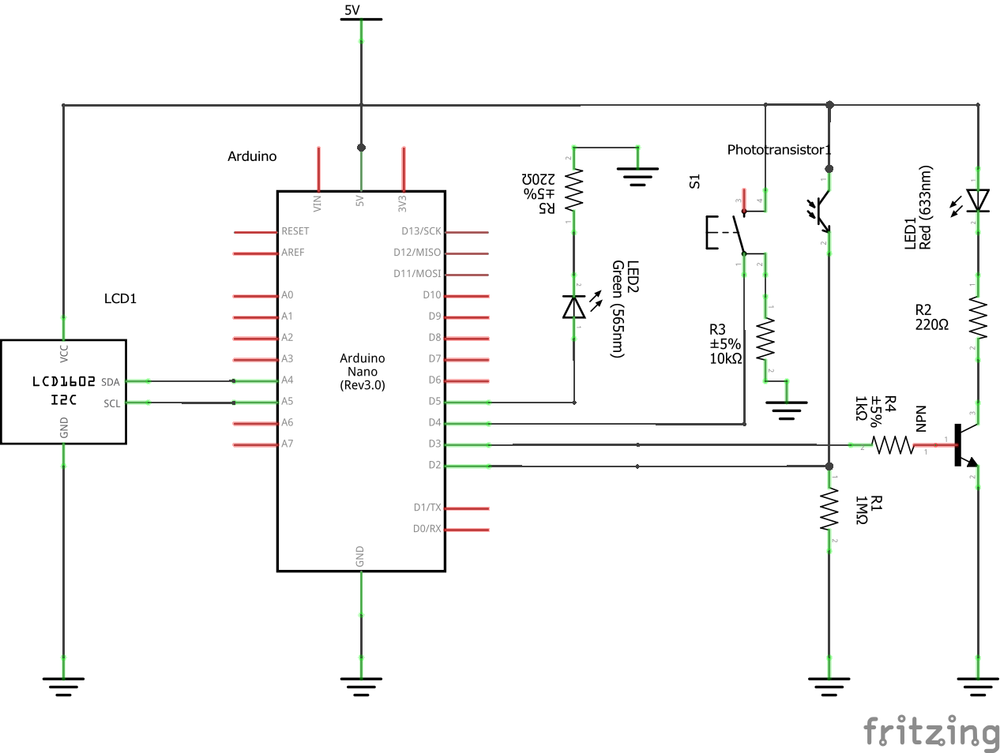

### Code

The code uses the [LiquidCrystal_I2C library](https://www.arduinolibraries.info/libraries/liquid-crystal-i2-c)

And here is the code result :
[Code for LCD Display](DevelopmentSteps/Step4_LCDDisplay/LCDDisplay/LCDDisplay.ino)

## 5. Bonus : create a sleeping mode

### Description  

The sleeping mode is intended to prevent the battery to get empty too fast when forgetting to switch off the device.

**TODO : implementation of a sleeping mode**

## 6. Create the Printed Circuit Board (PCB)

### Description  

The goal of this step is to create a PCB for our device
For the previous steps, we used Fritzing for the circuit description, because it is very convenied to draw quickly both schema and breadboard sketch.  
However, for the design of the target PCB, we will use a more precise design tool : Kicad.  
### Realisation
The first step is to create an empty project :  
[Kicad project](design/Kicad_shutter_speed_tester/shutter_speed_tester.pro)  

Then, the second step is to create a schema.
The goal of the schema is different from that one drawn with Fritzing : the goal is not to describe the whole circuit, but to focus on the main board of the tool.  
So some choices have to be made, mainly concerning the interfaces of this board :
* Internal interfaces  
  * I2C LCD
  * Power
* External interfaces
  * Light source LED
  * Light Sensor

| Internal Interfaces| Interface implementation |  
|---|---|
| I2C LCD | 4 pins PCB header |
| Power | 2 pins PCB header|
| Arduino socket | the Arduino will not be directly soldered on the main board, but placed on it using 2 rows of 15 pins female Dupont headers |

| External interfaces | Interface implementation|
| --- | --- |
| Light source LED | One option is to have a socket, such as an audio jack socket, directly soldered on the PCB, that socket would be accessible through a hole made at the side of the case. Such an option makes difficult the general design of the PCB and is considered as too constraining. The following solution is prefered : an internal PCB header is placed on the board. From this header is connected a wire, directly connected to the light source LED, or through a second connector placed at the side of the case.  another option is to have the light source LED wrapped at the side of the case, internally connected to the board using a wire.  So the choice is : 2 pins PCB header |
| Light Sensor| In order to be easily adapted to different camera format and models, the light sensor has to be placed in a separated device, that can easily adapt to camera backs. So a wire has to be used, directly or through an intermediate connector placed at the side of the case. In all cases we need :  2 pins PCB header |
| Reset button| The choice is to place the reset button on the main board, it will be mechanically accessible to the operator using a button placed through the case |
| Control LED | As for the reset button, the control LED will be soldered on the main board, and accessible to the operator through the case |

Conclusions : 
On the schema, the power, the light source, the light sensor and the lcd will not be present, but instead a connector will be used

Result : 
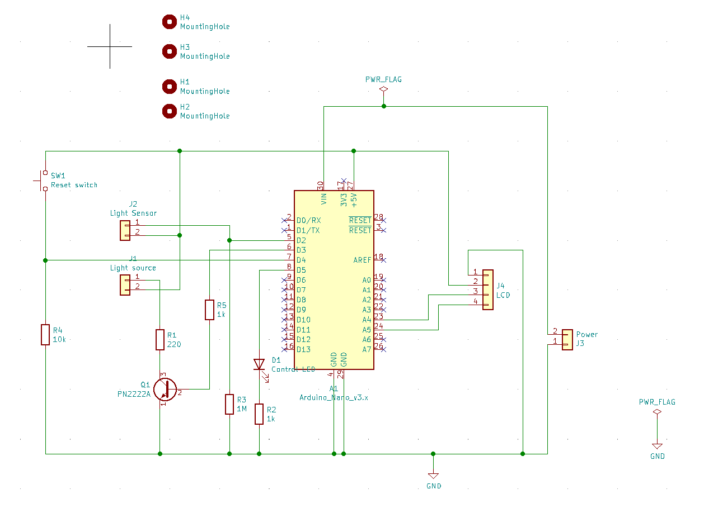

After the schema design, before beginning the physical design of the board, it is necessary to assign a physical component to each of the schematic component.  
For all the PCB headers, we decide to use Molex 6410 headers (they are also referenced KF2510, depending on the provider).  These headers are low priced, and cannot be plugged in the wrong way.

Here are the correspondance between the shematic components and the components footprints (the real components) :

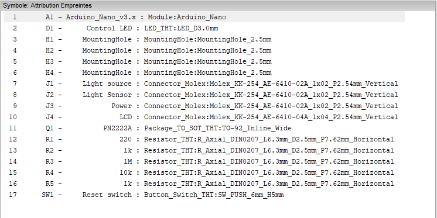

And then, the physical PCB can be designed :
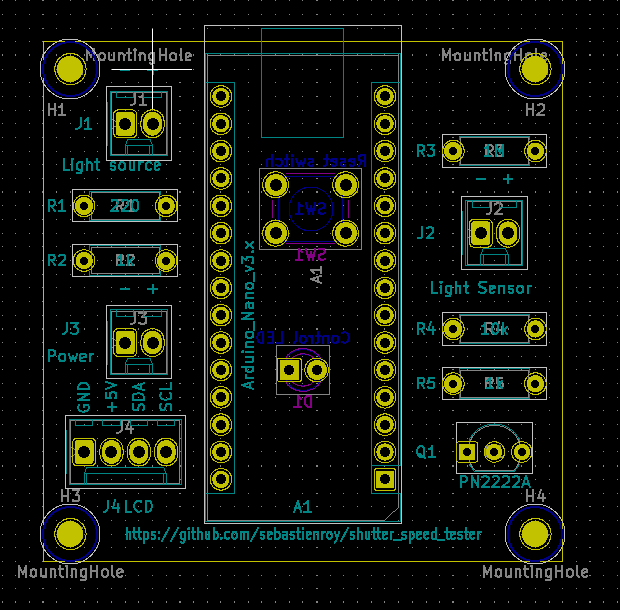

Note that the switch and the controled LED are placed at the back side of the board.
Note also that no via was used for the board design

And finally, the 3D views :
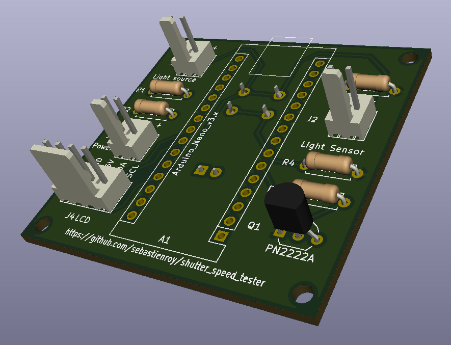

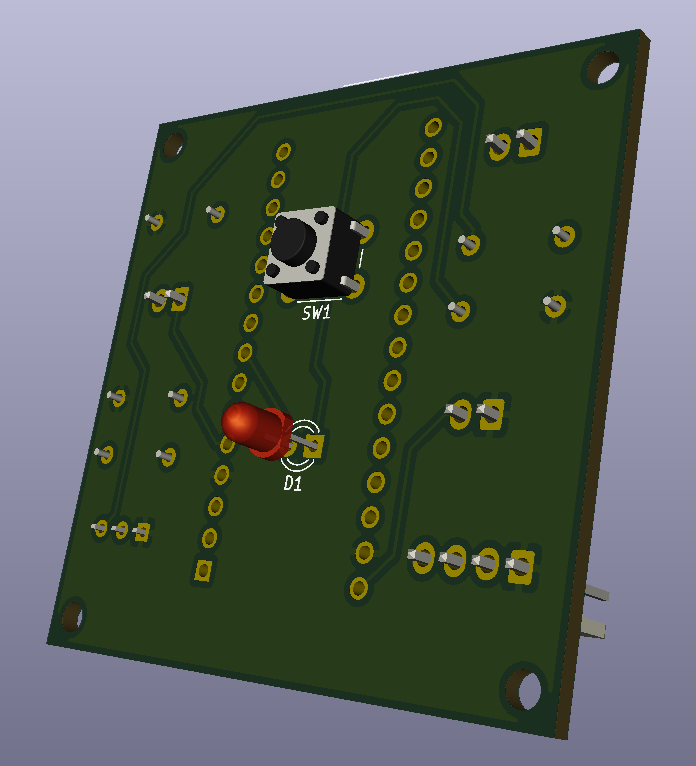

## 7. Design of the case, front side

### Description
Because designing the case may be a very complex activity, we will split in 3 steps :
* The design of the front panel
* The design of the case sides
* The design of the rear panel

Of course, the integration of these 3 parts has to be addressed

### Realisation
We use an open source model for LCD1602 : https://grabcad.com/library/1602-lcd-display-1

The Front panel need to put in place the main board, the LCD board, and te power switch. the thickness will be set to 1.5mm.

### Screw holes
One of the tricky thing is to choose the good screw hole diameter. It must be bigger than the core part of the screw, and smaller than the exernal diameter of the screw.
I have ordered iron plate screws, because they are most common than screxs for plastic.
However, screws for platics could have been ordered here :
https://www.visseriefixations.fr/eco-syn-pour-thermoplastiques-tcb-pozi-2-2x5-z-blanc.html  
We will order more specific screws when we'll have used all the screws we have ordered, described in the part list.
- Small screws : M2.2 x 6.5 mm
  - Core diameter : 1.9 mm
  - External diameter : 2.2 mm
- bigger screws : M2.9 x 13 mm
  - Core diameter : 2.2 mm
  - External diameter : 2.8 mm

Conclusion : we will use
  - 2 mm diameter for small screw holes (screws for pcb)
  - 2.5 mm diameter for bigger screw holes (screws for panels)

### Result 

Here is the front view :  
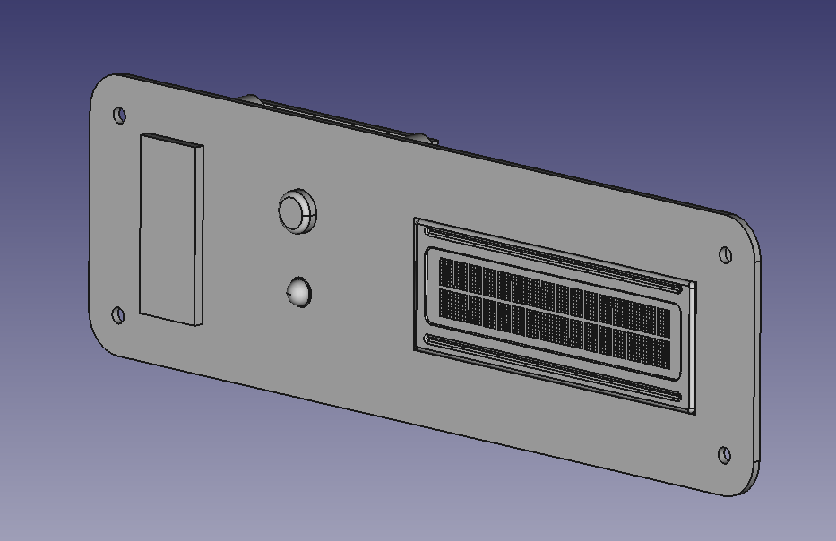  

And here is the back :  
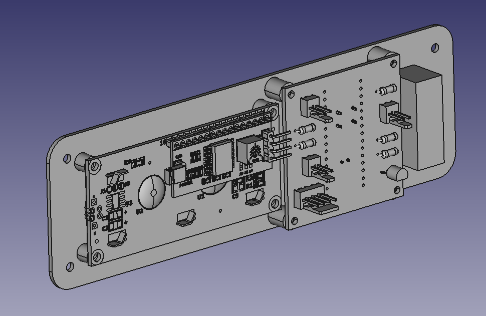

## 8. Light source housing

### Description

The case must take into account the size of the different elements, but also the need to hold the light source.
Decision is taken to hold the light source in the side of the case. This will make more simple the general handling of the tool. It than just has to be placed in front of the camera, and the light sensor in the back.
The goal is now to make a design in order to hold the light source LED in the wall of the case.  
The dimensional specifications of the light source LED are the following :  
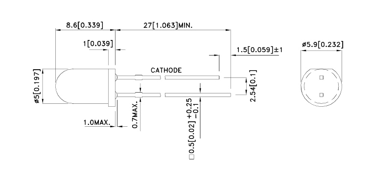

### Realisation

We will test that :

A first test shows that the concept is not bad. However, it needs a lot of sanding in order to be able to insert the LED into the hole. So, the tolerences have to be increased to make easier the insertion of the LEd. Furthermore, chamfers have been added to the hold piece.

## 9. Battery door

### Description

The idea is to create a door that can be opened by hand but that cannot open by itself.  
In one word, we wan to design a battery door.
The prefered design would need no screw.  

### Realisation

We use a well known design, that use a door with a slot at one side, that allows to unlock it by bending the side.  

Here is the inside view :

There is chamfers in the opposite direction on the door panel and on the outside panel, so they fit perfectly together. 
Howver, du to the 3D printing flaws, some tolerances have to be applied :  
The door panel has to be smaller of :
- the panel opening is 60x30 mm
- the door is 62 x 32
- The thickness of both panels is 1.5 mm
- the chamfers of both panels is 1.3 mm

The theretical overlap of each side is :  
thickness - 2 (thickness - chamfer)  = 2 chamfer - thickness. 
In our case it is : 2x1.3 - 1.5 = 1.1 mm
So, a perfectly build construction would have fit with a door having 62.2 mm x 32.2 mm.  
We use a little bit smaller dimensions to take into account the 3D printing flaws.

## 10. Prevent the sensor wire to rip

### Description
The light sensor will be placed at the back of the camera in a separate casing, and linked to the main body using a wire. The wire will be connected to the main board using a dedicated connector.  
The point to adress in this story is the way the wire passes through the casing. The problem to solve is to prevent to accidentaly rip the connecter by pulling on the wire. There is two ways to address this :  
- Using another connector to pass through the case panel
- blocking the wire, using for instance chicanes, inside the casing

### Realisation

**TODO**

## 11. LightSensorSupport

### Description  
The vision of the design of the LightSensor support is to have a core support, designed for the 35mm film format.  
To this, may be added adaptors to 120 film format : 645, 6x6, 6x9

Specifications of 35mm film can be read there :  
[Kodak film specification](https://www.kodak.com/content/products-brochures/Film/How-to-read-a-Kodak-film-can-label.pdf)

The 35mm film is 35mm large, 
Perforations pitch is 4.75mm.
Each perforation is about 2.8mm x 2.0mm large (KS perforation), at about 2 mm from the side of the film.  
Their corners are rounded, with 0.5mm radius.

Here are the physical specifications of the phototransistor :

## 12. Automatically update LCD IIC address

### description

The LCD display is connected through I2C interface. The interface has an address that can vary from one provider to another.
So the idea is to automatically set the address, instead of having it hard coded.  

This can be achieved using EEPROM memory.  
The library documentation is here :  
[Arduino EEPROM programming guide](https://docs.arduino.cc/learn/programming/eeprom-guide)
A hole must be provided in the middle of the support to hold this phototransistor.

### Realisation  

**TODO**

