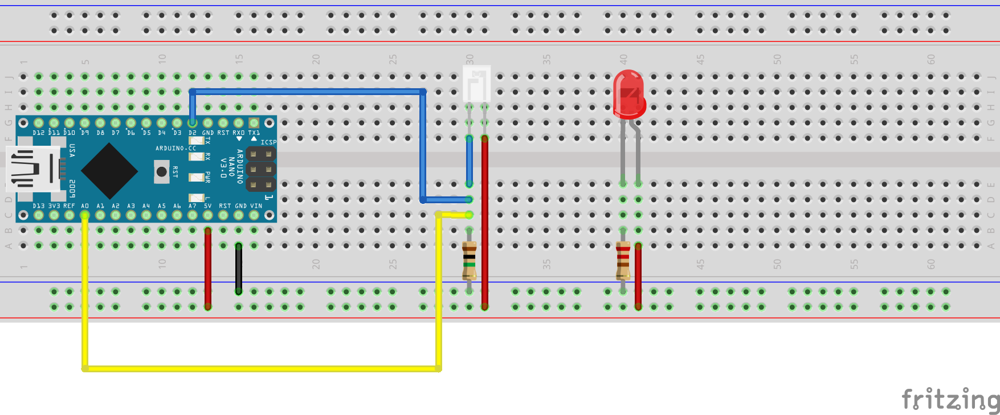
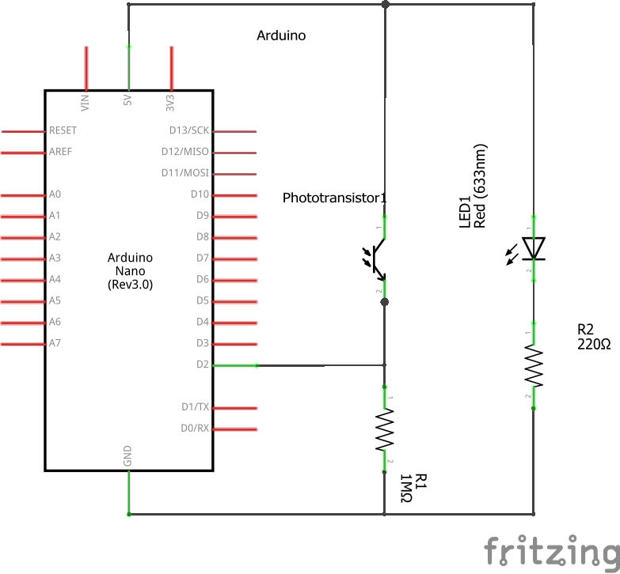
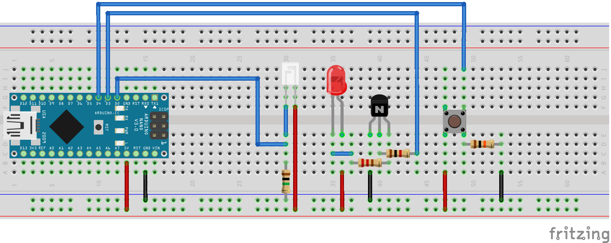
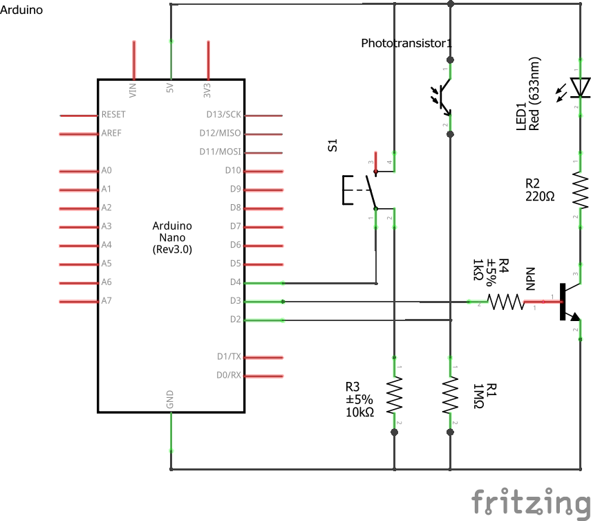

# Development Stories

## 0. Experimention : How to detect the opening a camera shutter

### Description

The aim of this story is to choose the right components and the right electronic schema in order to be able to detect the opening of a camera shutter, i.e how to detect a light source with a light sensor

### Acceptance criteria

The choice of the components and schema allow to detect a light source with a light sensor

### Realisation

With the following schema, it would be possible to check different values of resistor, and measure
* The voltage value induced by the phototransistor current, depending on the light illuminated it
* Which light intensity, for different resistor value, allow to swich the digital port of the Arduino

As a ligth source, we will use a standad led component, directly wired on the 5V output of the Arduino.  A 220 Ohm resistor is used to get an intensity less than 20 mA.  
20 mA is the maximum current value recommended for both Arduino output (even not used in this experimentation) and for a standard LED.  
$$
I = U/R = \frac{(5.0 - 1.2)}{220} \approxeq 17 mA
$$  
(The direct voltage of the Led is 1.2V)  

And here is the schema :

Be carefull to plug the anode pin (the longer leg) of the phototransistor and the LED to the + side of the circuit

The following code will allow to get written on the serial of the Arduino, every second, the current analog and digital values read on the phototransistor :

[Experimentation code](DevelopmentSteps/Step0_Experimentation/experimentation/experimentation.ino)

### Results

The higher is the resistor value between the phototransistor, the more sensitive is the result.
- With a 1k Ohm resistor, the measured voltage change a little when putting the phototransistor in front of the led  
- The sensibility increases with increasing value of resistor
- When using 1M Ohm resistor, it is possible to change the input state at a ~ 5 cm distance
- When using 4x1M Ohm resistors (serial circuit), it is even possible to change the state at 10 cm

Questions :
- What is the limit of increasing sensibility ?
- Is there a side efect of increasing the resistor, as for instance a slower reactivity ?
- Is it better to use a more powerfull LED or higher resistor value ?

## 1. Detection of the time interval between rising and falling edges of the shutter

### Description 

The goal of this step is to do the minimum of design and development to be able to compute the time interval between rising and falling edges of the shutter.  
This step can be considered as a kind of derisking.

### Test means

The source of light may be provided by an external device 
The result output may be written (and read) on the serial port of the Arduino

### acceptance criteria
The system detects the rising and falling edges of the shutter
The system computes the time differences between rising and falling edges

### Bibliography

A similar problem has been adressed in this page :
https://lederniermatou.net/arduino-et-phototransistor.html

### Realisation

The following circuit has been realized, based on the experimentation :  

  

Note that, in order to use the interupt capacity of the Arduino, only the D2 or D3 pins may be used for the phototransistor state change. The interrupt capacity is not available on the other pins.  

### Code

[Edges detection code](DevelopmentSteps/Step1_EdgesDetection/EdgesDetection/EdgesDetection.ino)

## 2. Implementation of behaviour states

### Description

The goal of this step is to implement the complete state diagram of the expected behaviour of the tool.  
The idea is to light on the source LED only when the user is ready to start the measure, and to switch it off as soon as the measure is performed.  
A button allows to start a new measure.

State diagram :

### Realisation schema :
The implementation of the state diagram needs :
- a way to switch on and off the illumination LED. The choice is to achieve this using a command transistor. The justification of this is that it allows to use a LED that uses more than 20 mA, without deteriorating the Arduino pin.
- a push button in order to be able to start the measure again.  

  

### Code  

[State diagram Code](DevelopmentSteps/Step2_BehaviourStates/BehaviourStates/BehaviourStates.ino)

## 3. Add control LED

### Description  

After the previous step, which was very complex, this one will be very easy.  
The goal is to add a control LED, that is lit when the phototransistor detects light. This helps the user to see that the illumination LED and the light sensor are correctly positionned.  
The control LED has to be switched on only during the "Shutter open" state.

### Realisation schema

Here is the realisation schema for this new element :  

  

### Code  

In order to prevent the control LED to be too bright, we use the PWM capability of the Arduino

[Control LED](DevelopmentSteps/Step3_ControlLED/ControlLED/ControlLED.ino)

## 4. Display on LCD screen

### Description  

All the previous experimentation and coding used the serial port of the Arduino to write the results.  
However, the target is to diplay the messages and the measure result on a dedicated display.  
The most common and cheap display are 16x2 LCD display. They can be addressed directly, or through an I2C interface.  
We will use this second option for the following reasons :  
- less wires from the Arduino to the LCD
- The IC2 interface integrates a potentiometer that adjusts the LCD screen contrast. So it hasn't to be added in the rest of the schema

